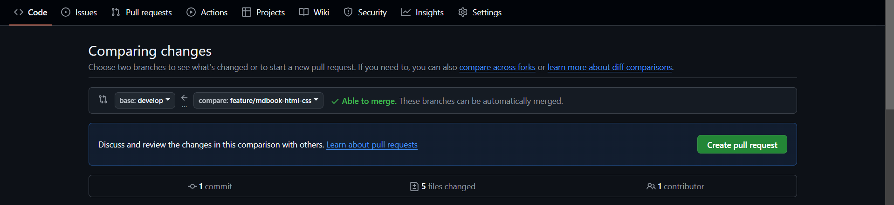
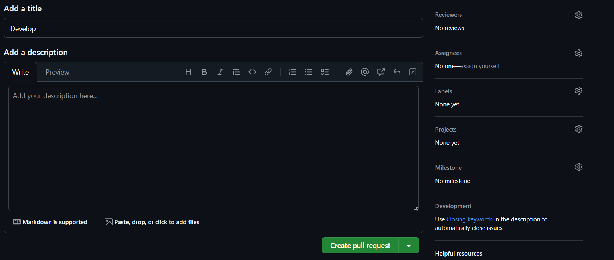

# Criando um Pull Request no GitHub

## Passos a seguir

Caso tenha acabado de realizar as alterações necessárias no código em um branch separada, chegou a hora de abrir um PR para a branch de desenvolvimento (develop) ou para principal (main). Primeiramente faça o os comandos: "git add .", "git commit -S -m "texto-do-commit"" e "git push origin nome-da-branch", em seguida vá até o repositório remoto do seu projeto no github

## Revisando PR

## Boas práticas