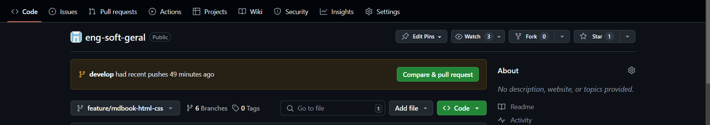
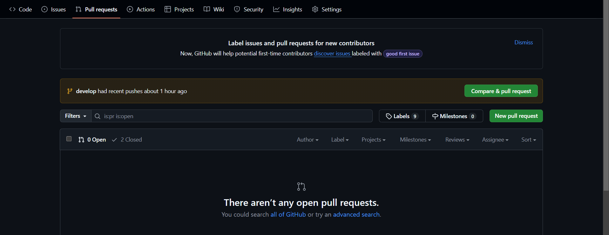
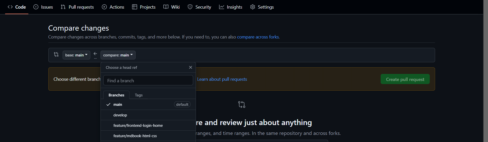
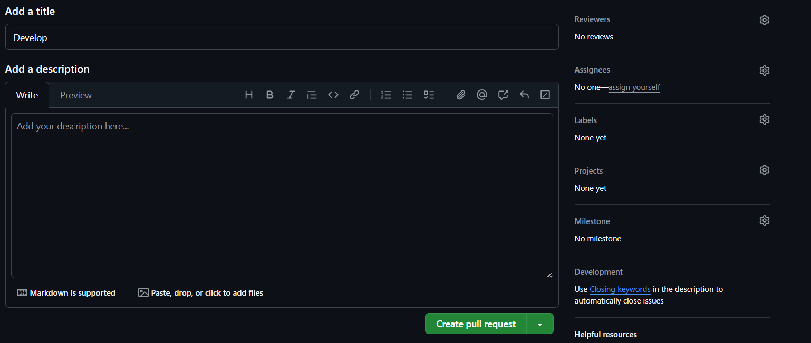
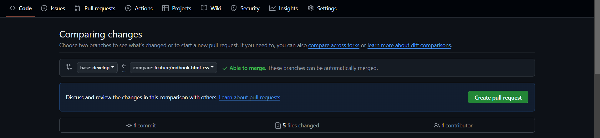
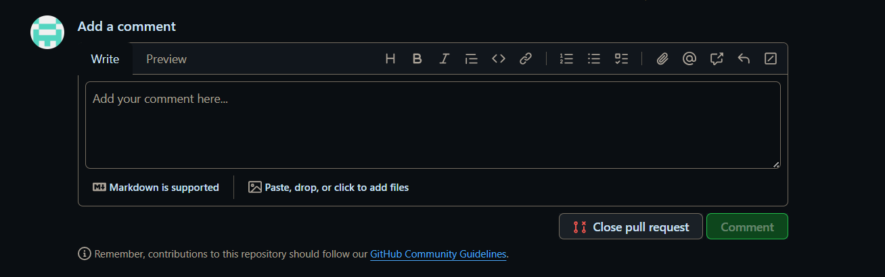
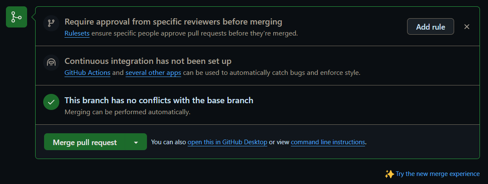

# 2.4 Criando um Pull Request no GitHub

## 2.4.0 Passos a seguir

Caso você tenha concluído as alterações necessárias em uma branch separada, siga os passos abaixo para criar seu Pull Request:

### 1. Push das alterações:

```console
# Adicione todas as alterações à staging area:  
$ git add .

# Faça o commit com uma mensagem clara e assinada
$ git commit -S -m "<texto-do-commit>"

#Faça o push do branch
$ git push origin <nome-da-branch>
```

### 2. Crie o PR no repositório remoto:


*Acesse a página do seu repositório no GitHub e Selecione a opção "Pull requests" ou apenas clique em "compare & pull request caso a branch que acabou de fazer push seja a mesma que deseja incluir no PR"*





*Escolha as branchs de origem e destino (geralmente o destino é main ou develop) e revise as alterações*


*Adicione um título e uma descrição das alterações feitas para facilitar o code review*


*Verifique se as branch de origem e destinop estão "able to merge", se sim confirme em "create pull request" se não volte à sua IDE e resolva o(s) conflito(s) de merge*

### 3. Revisão do PR


*Após verificar as alterações feitas em cada commit do PR adicione seus comentários*


*Caso tenha passado no Code Review e esteja "Able to merge" confime o merge*

## 2.4.1 Boas práticas

- **Mensagens de Commit Descritivas**:  
    Use mensagens de commit claras e detalhadas para explicar o motivo das alterações.
    ex.:

```console
$ git commit -S -m "feat: endpoint para login de usuário"
$ git commit -S -m "chore: adição do container docker a partir da imagem do postgres:latest"
$ git commit -S -m "fix: corrige validação de email no formulário de cadastro "
```

- **Testes Automatizados**:  
    Inclua testes automatizados em uma pipeline de CI (Continous Integration), para evitar bugs em produção. Para isso existem ferramentas como GitHub actions, jenkins e entre outras.

- **Feedback Construtivo**:  
    Seja claro e direto nos feedbacks, destaque o que pode melhorar e o que foi bem feito.

- **Relacionar PRs a issues**:
    Caso o PR seja a resolução de uma issue, destaque que há esta relação no titulo do PR, ex.: Resolves #123

## 2.4.2 Dicas para evitar conflito de merge 

- Antes de criar um PR, certifique-se de que sua branch está atualizada com a branch de destino

```console
$ git pull origin <branch-de-destino>
```

- Se houver conflitos de merge, resolva-os em sua máquina antes de enviar o PR. Use ferramentas como git mergetool para facilitar o processo.


