# Capítulo 8 - MVC (Model-View-Controller)

## 8.1. Visão Geral do Mini-Framework (Objetivos e Arquitetura)

Como dito anteriormente, vamos explorar o padrão de arquitetura MVC (Model-View-Controller) criando nosso próprio mini-framework MVC, que será utilizado para evoluir alguns conceitos que aprendemos nos capítulos anteriores. 

### Motivação e Objetivos

O desenvolvimento de software moderno raramente acontece sem o uso de frameworks. Estes abstraem complexidades técnicas e oferecem estruturas organizacionais que aceleram o desenvolvimento. No entanto, muitos desenvolvedores utilizam frameworks como "caixas pretas", sem compreender seus mecanismos internos. Esta abordagem limita a capacidade de, diagnosticar e resolver problemas complexos, otimizar performance em cenários específicos, adaptar soluções para necessidades particulares.

Construir um mini-framework "from scratch" oferece insights valiosos sobre padrões de design, arquitetura de software e boas práticas de desenvolvimento.

> Obs.: antes de começarmos, definimos que o objetivo pedagógico do mini-framework não é “reinventar o Laravel”, mas isolar os blocos mínimos que ajudam a entender por que frameworks fazem o que fazem. Cada escolha apresentada a seguir responde a uma pergunta: “Qual dor real essa ferramenta resolve?”

### Arquitetura Geral

Representamos a arquitetura do mini-framework da seguinte forma:
- Core (núcleo): contém os componentes essenciais que implementam o mini-framework, incluindo o sistema de roteamento, controladores, sistema de renderização e manipulação de requisições.
- Application Logic (aplicação): contém a lógica específica da aplicação, como serviços, controladores, DAOs, Mappers e entidades de domínio.
- Presentation Layer (View): contém a lógica de apresentação, como templates, layouts e componentes de interface do usuário.

#### Como chegamos a esse diagrama? (Recapitulando a jornada do t07 ao t08)

Para entender o diagrama final é útil relembrar de onde viemos no módulo anterior (`t07-composer`). Lá tínhamos:

1. Um único "index.php" atuando como roteador manual (switch gigante em cima da URL)
2. Controllers responsáveis por upload, redirecionamento e mensagens de sessão mas também por com SQL indireto via DAOs (múltiplas responsabilidades)
3. Ausência de camada Service: a orquestração da lógica de negócio (ex.: upload de post) morava direto no Controller
4. Retornos mistos (arrays associativos + inclusão direta de "view/*.php")
5. Validações espalhadas e repetidas (ex.: checagens de sessão / permissões em vários pontos)

Evoluímos para `t08` em passos incrementais, cada um motivado por um problema real:

1. Router dedicado: substitui o `switch` do `index.php` por um componente focado em mapear método + path → ação. Motivo: reduzir duplicação e permitir middlewares.
2. Controllers emagrecidos: tudo que não era controle de fluxo (regra, validação, upload) começou a migrar.
3. Services: criados quando percebemos que a lógica de criar post envolvia múltiplas operações (validar → salvar arquivo → persistir → recuperar feed). Centralizamos para reutilização e testes (falaremos sobre testes nos próximos capítulos).
4. DAOs isolados: já existiam no t07, mas refinamos para que não retornassem arrays arbitrários misturando semântica, mantendo foco exclusivo em persistência.
5. Domain Entities: adicionadas para encapsular invariantes, ou seja, regras de negócio (ex.: `Follow` não pode permitir self-follow; `Post` gera `uploadDate` no construtor), evitando espalhar ifs pela aplicação.
6. Mappers: apareceram quando o enriquecimento (JOIN com username/ avatar de usuário) não cabia nem no domínio puro nem em arrays anônimos, desse modo, formalizamos conversões. Os Mappers atuam como intermediários, transformando dados entre diferentes camadas, para garantir que cada camada receba a estrutura de dados que espera. Por exemplo: um Mapper pode converter um array de dados brutos em uma entidade de domínio rica, que contém regras de negócio e validações necessárias.
7. ViewModels: criados após notar que a view precisava de dados agregados (domain Post + username + foto) mas não fazia sentido “poluir” a entidade `Post` com campos de apresentação.
8. Templates / Layouts / Components: Criados quando percebemos que cabeçalhos, navegação e mensagens flash divergiam entre páginas devido a cópia/cola, com isso, conseguimos reutilizar código e manter a consistência visual.

Cada adição só aconteceu após um problema concreto no estágio anterior (duplicação, ambiguidade ou dificuldade de teste). Assim o diagrama é a fotografia de uma evolução incremental.

### Por que não apenas "Model" genérico?

Em muitos tutoriais sobre MVC, o componente "Model" acaba se transformando em um verdadeiro "canivete suíço", concentrando responsabilidades que deveriam estar separadas: manipulação de SQL, validação de dados, regras de negócio e formatação para apresentação. Essa abordagem monolítica torna o código difícil de testar, manter e evoluir, pois qualquer mudança em uma dessas responsabilidades pode impactar todas as outras.

Reconhecendo esses problemas, optamos por uma decomposição consciente do "Model" tradicional em componentes menores e mais focados. As Domain Entities (Entidades Ricas) ficam responsáveis exclusivamente pelas regras de negócio e invariantes do domínio, como garantir que um usuário não possa seguir a si mesmo ou que todo Post tenha uma data de criação automaticamente definida. Os DAOs (Data Access Objects) concentram-se na leitura e gravação otimizada de dados, incluindo joins, filtros e paginação, mas sem conter qualquer lógica de negócio.

Os Mappers atuam como pontes de conversão, transformando resultados de consultas em objetos de domínio estruturados, enquanto os Services coordenam casos de uso que envolvem múltiplas entidades e operações, como criar um post junto com o upload da imagem correspondente. Quando necessário, utilizamos ViewModels para adaptar dados ricos do domínio com atributos específicos de apresentação, como o "PostFeedItem" que combina informações do Post com username e avatar do autor, sem "contaminar" a entidade original com dados de exibição, que fogem do escopo do domínio.

Essa decomposição emergiu naturalmente após observar problemas recorrentes no desenvolvimento: validações duplicadas espalhadas pelo código, controllers sobrecarregados com múltiplas responsabilidades e retornos inconsistentes que ora eram arrays, ora objetos. A refatoração sequencial nos levou a mover validações para o domínio, enriquecimento visual para ViewModels, operações de persistência para DAOs e transformações de dados para Mappers, resultando em um código mais limpo, testável e manutenível.

### Estrutura geral do diretório

Note que existe uma separação "core/" e "src/", isso permite que a aplicação evolua sem alterar o núcleo, facilitando a manutenção e a escalabilidade. Desse modo, podemos adicionar novas funcionalidades ou modificar as existentes sem impactar o funcionamento básico do framework.

### Estrutura geral deste capítulo

Para facilitar a compreensão, este capítulo está dividido em duas partes principais:

**Parte I — Fundamentos do mini-framework (core)**
Explora os componentes centrais, localizados em "core/":
- Sistema de Roteamento (Router)
- Controlador de Execução (Controller)
- Sistema de Renderização (View)
- Manipulação de Requisições (Request/Response)

**Parte II - Aplicação Prática**
Demonstra como utilizar o framework na construção de uma aplicação real, incluindo:
- Configuração de rotas
- Implementação de controllers
- Criação de views e layouts
- Organização da lógica de negócio

## Próximos passos

Agora podemos explorar a parte I, onde abordaremos o core da nossa aplicação MVC. Mas antes, vamos revisar/aprofundar nos conceitos que fundamentais que já discutimos anteriormente de maneira breve.
