# Capítulo 8 - MVC (Model-View-Controller)

## 8.2. Parte I - Fundamentos do Framework

A construção de um framework MVC representa uma jornada de compreensão profunda dos princípios fundamentais que regem a arquitetura de software moderna. Nesta primeira parte, estabeleceremos os alicerces conceituais e técnicos necessários para implementar um sistema robusto, escalável e manutenível.

### Objetivos desta parte

Ao final da Parte I, você terá desenvolvido o mini-framework MVC com e compreendido os seguintes componentes:

- **Sistema de Roteamento Avançado (Router Groups + Middlewares)**: Um mecanismo sofisticado para mapear requisições HTTP para controladores específicos, incluindo suporte a parâmetros dinâmicos, grupos de rotas e middlewares
- **Arquitetura de Controladores**: Um sistema de dispatch que facilita a separação de responsabilidades e promove código limpo e testável
- **Engine de Renderização**: Um mecanismo flexível para geração de respostas (HTML, JSON, etc.), suportando templates, layouts e componentes reutilizáveis
- **Abstração HTTP (Request e Response)**: Interfaces consistentes para manipulação de requisições e respostas, abstraindo complexidades do protocolo HTTP
- **Flash Messages**: Um sistema para armazenar mensagens temporárias entre requisições, útil para feedback ao usuário
- **Gerenciamento completo de Sessões**: Um sistema para gerenciar o estado do usuário entre requisições, permitindo a persistência de dados temporários

Esta base teórica sólida servirá como fundamento para a implementação prática que desenvolveremos na Parte II, onde aplicaremos estes conceitos na construção de uma aplicação web completa.

>**Navegação e sequência de estudo**
>
>Este capítulo foi estruturado para fornecer uma progressão lógica do conhecimento. Recomenda-se seguir a sequência proposta, pois cada seção constrói sobre conceitos apresentados anteriormente. Após concluir os fundamentos teóricos aqui apresentados, você estará preparado para mergulhar na implementação prática iniciando pela seção 8.2 (Sistema de Roteamento), onde veremos o primeiro componente em ação.

### Arquitetura Model-View-Controller: Fundamentos e Filosofia

Antes de mergulharmos na implementação prática do nosso mini-framework, é crucial entender mais a fundo os fundamentos teóricos que sustentam a arquitetura Model-View-Controller. O padrão MVC representa uma das contribuições mais significativas para a engenharia de software, transcendendo sua origem na década de 1970 para tornar-se um paradigma fundamental no desenvolvimento de aplicações modernas. Sua longevidade e relevância derivam não apenas de sua eficácia técnica, mas de sua capacidade de refletir princípios fundamentais do desenvolvimento de software: modularidade, abstração e separação de preocupações.

### Os Três Pilares do MVC

O padrão MVC funciona dividindo sua aplicação em três partes bem definidas, cada uma com sua própria responsabilidade. Pense nisso como uma equipe onde cada membro tem um papel específico:

**A Dimensão dos Dados e Regras de Negócio (Model)**: Esta camada encapsula não apenas a representação dos dados, mas a semântica e as invariantes (regras de negócio) que definem o domínio da aplicação. O Model funciona como um guardião da integridade dos dados, assegurando que todas as operações respeitem as regras fundamentais que governam o sistema.

A responsabilidade do Model vai além do simples armazenamento de dados, feitos por comandos SQL diretos ou abstrações fornecidas por ORMs. Para incluir a modelagem de processos de negócio complexos, validação de invariantes de domínio, e a manutenção de consistência transacional se fazem necessários. Esta camada deve ser agnóstica em relação aos mecanismos de apresentação, permitindo que a mesma lógica de negócio seja reutilizada para diferentes clients (web, mobile, APIs, etc.). 

**A Dimensão da Apresentação e Interação (View)**: A camada de View náo se restringe somente à renderização de dados para encompassar toda a experiência do usuário. Ela é responsável por traduzir estruturas de dados em representações compreensíveis e interativas, adaptando-se às capacidades e limitações específicas de cada meio de apresentação.

Desse modo, a View deve manter uma separação rigorosa entre lógica de apresentação e lógica de negócio, funcionando como um intérprete que converte o estado interno da aplicação em linguagens visuais apropriadas. Esta separação permite que mudanças na apresentação sejam implementadas sem afetar a lógica fundamental do sistema, facilitando adaptações para novos formatos de saída (ex.: HTML, JSON) ou paradigmas de interface (ex.: mobile, desktop).

**A Dimensão do Controle e Orquestração (Controller)**: O Controller representa o núcleo organizacional da aplicação, funcionando como um maestro que coordena a interação entre Model e View. Sua responsabilidade principal é interpretar as intenções do usuário, traduzindo-as em operações específicas sobre o Model e determinando as respostas apropriadas através da View.

Esta camada implementa a lógica de fluxo da aplicação, gerenciando estados transitórios (ex.: sessões de usuário), validando autorizações, fazendo redirecionamentos e exibindo mensagens ao usuário. O Controller deve permanecer focado em sua função de coordenação, delegando responsabilidades específicas para as camadas apropriadas e mantendo-se como uma interface limpa entre o mundo externo e a lógica interna da aplicação.

### Dinâmica de Fluxo e Comunicação

Em uma implementação MVC bem estruturada, o fluxo de informações segue um protocolo rigoroso que preserva a integridade arquitetural:

**Fase de Iniciação**: Requisições externas são sempre recebidas pelo Controller, que atua como ponto de entrada único para o sistema. Esta centralização permite implementação consistente de políticas transversais como autenticação, logging e tratamento de erros.

**Fase de Processamento**: O Controller interpreta a requisição, identifica as operações necessárias sobre o Model, e coordena a execução dessas operações. Durante esta fase, o Controller pode realizar validações de entrada, como sanitização do input e aplicar regras de autorização, como verificação de permissões com base na role do usuário (esses dados são mantidos no contexto da sessão).

**Fase de Resposta**: Com base nos resultados obtidos do Service/model, o Controller seleciona a View apropriada e fornece os dados necessários para serem renderizados. A View processa estes dados de acordo com templates e regras de apresentação específicas, gerando a resposta final.

Este fluxo unidirecional e bem definido garante que responsabilidades permaneçam apropriadamente distribuídas e que o sistema mantenha comportamento mais previsível para os devs, mesmo em cenários complexos.

### Variações Evolutivas do Padrão MVC

O padrão MVC, ao longo de suas décadas de evolução, deu origem a diversas variações que respondem a necessidades específicas de diferentes paradigmas de desenvolvimento e contextos tecnológicos. Cada variação representa uma adaptação fundamental dos princípios originais para atender demandas particulares:

**Model-View-Presenter (MVP)**: Esta variação emerge como resposta à necessidade de maior testabilidade em interfaces de usuário complexas. No MVP, o Presenter assume responsabilidades expandidas, tornando-se um intermediário mais ativo que remove praticamente toda a lógica da View. Esta abordagem resulta em Views quase completamente passivas, que funcionam principalmente como receptores de comandos do Presenter. A principal vantagem desta arquitetura reside na capacidade de testar completamente a lógica de apresentação sem depender de componentes de interface gráfica, facilitando desenvolvimento orientado por testes (TDD) em aplicações com interfaces complexas.

**Model-View-ViewModel (MVVM)**: Desenvolvido especificamente para aproveitar capacidades de data binding bidirecional (dados que fluem em ambas as direções), presentes em frameworks modernos, o MVVM introduz o conceito de ViewModel como uma abstração da View que expõe propriedades e comandos bindáveis. Esta arquitetura permite sincronização automática entre estado da interface e dados subjacentes, reduzindo significativamente o código boilerplate necessário para manter consistência entre apresentação e dados. O ViewModel funciona como uma representação orientada à apresentação do Model, transformando dados de domínio em formatos otimizados para consumo pela interface.

>Obs.: Usar ViewModel em algumas circunstâncias de desenvolvimento de uma aplicação MVC não necessariamente indica que a arquitetura MVVM está sendo adotada. Em vez disso, pode ser uma estratégia para melhorar a separação de preocupações e facilitar a testabilidade, mantendo a estrutura básica do MVC. Para ser de fato MVVM, a aplicação deve adotar o data binding bidirecional e a comunicação entre View e ViewModel deve ser feita através de propriedades e comandos bindáveis, ou seja, é necessário que a View se conecte ao ViewModel de forma mais direta, sem intermediários.

**Component-Based Architecture**: Esta evolução reconhece que aplicações modernas frequentemente beneficiam-se de decomposição em componentes autocontidos que encapsulam suas próprias responsabilidades de Model, View e Controller. Cada componente mantém um ciclo de vida independente e comunica-se com outros componentes através de interfaces bem definidas. Esta abordagem facilita reutilização, manutenção e desenvolvimento paralelo por equipes distribuídas.

### Desafios Arquiteturais e Considerações Práticas

A implementação eficaz do padrão MVC requer navegação cuidadosa através de diversos desafios inerentes à sua natureza modular:

**Gestão da Complexidade Inicial**: Aplicações simples podem parecer desnecessariamente complexas quando submetidas à estrutura completa do MVC. Este paradoxo surge porque o padrão foi concebido para gerenciar complexidade emergente, não simplificar aplicações inerentemente simples. A decisão de quando aplicar MVC completo versus abordagens mais diretas requer julgamento arquitetural baseado em projeções realistas sobre a evolução futura da aplicação.

**Coordenação Inter-Camadas**: A comunicação inadequada entre componentes pode resultar em acoplamento implícito que mina os benefícios da separação de responsabilidades. Design Patterns como Observer, Mediator e Event Sourcing frequentemente são necessários para manter comunicação limpa entre camadas. A implementação destes padrões de design deve ser considerada parte integral da arquitetura MVC, não adições posteriores.

**Considerações de Performance**: A introdução de múltiplas camadas inevitavelmente adiciona overhead computacional através de indireções adicionais. Este overhead deve ser balanceado contra benefícios de manutenibilidade e escalabilidade. Em sistemas de alta performance, técnicas como lazy loading, caching inteligente e otimizações específicas de cada camada tornam-se essenciais.

### Aplicação Específica no Desenvolvimento Web

O domínio web apresenta características que tornam o padrão MVC particularmente adequado, porém também impõem a necessidade de adaptações específicas:

**Roteamento como Abstração Fundamental**: No contexto web, o sistema de roteamento funciona como uma camada adicional que mapeia URLs para Controllers específicos. Esta abstração permite que URLs sejam tratadas como uma DSL (Domain Specific Language) que expressa intenções do usuário em termos de operações sobre recursos da aplicação. Roteamento avançado inclui capacidades como rotas com parâmetros dinâmicos, constraints de validação (ex.: regex), agrupamento hierárquico de rotas e aplicação de middlewares.

**Estado e Sessões**: A natureza stateless (sem estado) do HTTP requer mecanismos especiais para manutenção de estado entre requisições. Sessions, cookies e tokens devem ser integrados ao fluxo MVC de forma que preserve o fluxo de autenticação e autorização. O Model deve ser capaz de reconstituir estado necessário a partir de informações de sessão, enquanto o Controller gerencia ciclo de vida de sessões e o View adapta apresentação baseada em estado de autenticação e autorização.

**Middlewares**: Aplicações web frequentemente requerem funcionalidades transversais como autenticação, logging, rate limiting e transformação de dados. Estas preocupações devem ser implementadas como middleware, permitindo que sejam aplicadas de forma consistente em todas as rotas e controladores, sem a necessidade de duplicação de código. Os middlewares interceptam requisições e respostas, permitindo a aplicação de lógica adicional antes ou depois do processamento principal.

Essas camadas adicionais de abstração são fundamentais para a construção de aplicações robustas e escaláveis para a web, tanto em MVC quanto em outras arquiteturas.

### Preparando o Terreno

A compreensão profunda destes fundamentos teóricos prepara o terreno para a implementação prática que desenvolveremos nas seções subsequentes. Cada componente que construiremos, Router, Controller, View, Request/Response, será fundamentado nestes princípios.

Na próxima seção, vamos começar a construir nosso mini-framework implementando o componente mais importante: o **Router**. Ele será responsável por receber todas as requisições e direcioná-las para o controller correto.

