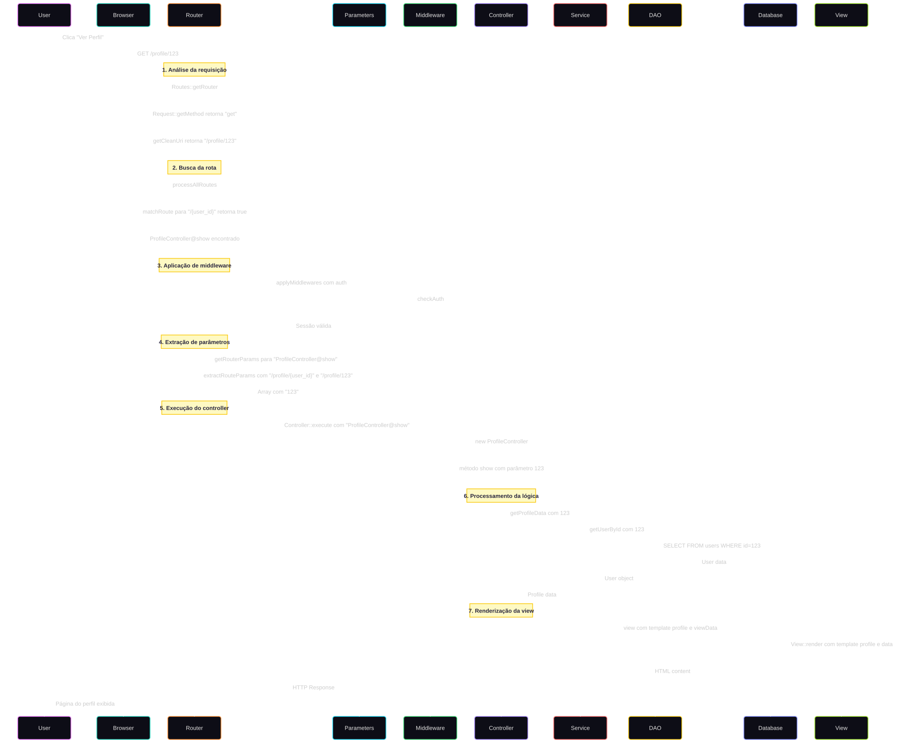

# Capítulo 8 - MVC (Model-View-Controller)

## 8.2.1. Router: de URL para Controller e Middlewares

### Fundamentos do Roteamento na web

O roteamento em aplicações web é o mecanismo responsável por mapear URLs para métodos específicas no código. Em um framework MVC, o router atua como o primeiro ponto de contato com requisições HTTP, determinando qual controller deve processar cada solicitação e extraindo parâmetros relevantes da URL.

>Objetivos de aprendizagem
>- Mapear URLs para controllers/métodos de forma declarativa
>- Entender grupos de rotas, middlewares e extração de parâmetros
>- Preparar base para controllers enxutos na próxima seção (8.3)

>Pré‑requisitos
>- Conceitos de HTTP (métodos, paths, status codes)
>- Recapitulação do roteamento manual do t07 (switch no index.php)

### Sistema de Roteamento

| Vantagem | Descrição |
|----------|-----------|
| Organização | Rotas agrupadas por funcionalidade |
| Flexibilidade | Suporte a parâmetros dinâmicos |
| Segurança | Middleware de autenticação |
| Performance | Matching eficiente de rotas |
| Manutenibilidade | Fácil adicionar/remover rotas |

### Anatomia de uma Rota

Antes de implementar, vamos entender os componentes de uma rota:

```php
// Estrutura básica de rotas
'groups' => [
    'profile' => [  // ← Grupo (prefixo)
        'middleware' => ['auth'], // ← Middleware
        'get' => [
            '/{user_id}' => 'site\ProfileController@show'  // ← Rota → Controller@Método
        ]
    ]
]
```

**Componentes:**
- **Grupo**: Organiza rotas relacionadas (`admin`, `api`, `profile`)
- **Método HTTP**: `GET`, `POST`, `PUT`, `DELETE`
- **Padrão da URL**: `/profile/{user_id}` (com parâmetros dinâmicos)
- **Controller**: Classe que processará a requisição
- **Método**: Função específica no controller
- **Middleware**: Filtros aplicados antes do controller

### Processamento de Rotas

O processamento de rotas transforma uma requisição HTTP simples em uma resposta estruturada através de uma sequência bem definida de operações. Este mecanismo funciona como uma linha de produção onde cada etapa tem uma responsabilidade específica.

<div align="center">

</div>

#### Etapa 1: Recepção da Requisição

Quando um usuário clica em "Ver Perfil", o browser envia uma requisição `GET /profile/123`. Esta requisição chega ao arquivo `index.php`, que funciona como porteiro da aplicação:

```php
// t08-mvc/index.php (simplificado)
require_once 'vendor/autoload.php';

$router = new \Conex\MiniFramework\mvc\Router();
$router->dispatch();
```

O construtor do Router carrega todas as rotas configuradas no "Routes.php" através do método estático `Routes::getRouter()`:

```php
// t08-mvc/core/mvc/Router.php (construtor)
public function __construct()
{
    $this->routes = Routes::getRouter(); // Carrega configuração completa
}
```

O método `dispatch()` inicia todo o processo de análise. Primeiramente coletando informações básicas sobre a requisição:

```php
// t08-mvc/core/mvc/Router.php (método dispatch)
public function dispatch(): void
{
    $method = Request::getMethod(); // Retorna 'get'
    $uri = self::getCleanUri(); // Retorna '/profile/123'
    
    $result = $this->processAllRoutes($this->routes, $method, $uri);
    // ... resto do processamento
}
```

O método "getCleanUri()" normaliza a URI removendo query strings e padronizando barras finais:

```php
// t08-mvc/core/mvc/Router.php
public static function getCleanUri(): string
{
    $uri = parse_url($_SERVER['REQUEST_URI'], PHP_URL_PATH);
    return rtrim($uri, '/') ?: '/';  // Remove barra final, exceto para '/'
}
```

#### Etapa 2: Busca da Rota Correspondente

Com o método HTTP (`get`) e a URI (`/profile/123`) em mãos, o sistema executa o coração do roteamento: o método `processAllRoutes()`. Este método é responsável por encontrar qual controller deve processar a requisição:

```php
// t08-mvc/core/mvc/Router.php
private function processAllRoutes(array $routes, string $method, string $uri): ?array
{
    if (!isset($routes['groups'])) {
        return null; // Sem grupos configurados
    }
    
    foreach ($routes['groups'] as $prefix => $groupRoutes) {
        // Calcula o caminho do prefixo
        if ($prefix === '') {
            $prefixPath = '';                    // Grupo raiz
            $routeWithoutPrefix = $uri;
        } else {
            $prefixPath = '/' . trim($prefix, '/'); // /profile, /admin
            if (strpos($uri, $prefixPath) !== 0) {
                continue; // URI não pertence a este grupo
            }
            $routeWithoutPrefix = substr($uri, strlen($prefixPath)); // Remove prefixo
        }
        
        // Busca correspondência exata primeiro
        if (isset($groupRoutes[$method][$routeWithoutPrefix])) {
            return [
                'controller' => $groupRoutes[$method][$routeWithoutPrefix],
                'middlewares' => $groupRoutes['middleware'] ?? []
            ];
        }
        
        // Busca correspondência com parâmetros dinâmicos
        if (isset($groupRoutes[$method])) {
            foreach ($groupRoutes[$method] as $route => $controller) {
                if (self::matchRoute($route, $routeWithoutPrefix)) {
                    return [
                        'controller' => $controller,
                        'middlewares' => $groupRoutes['middleware'] ?? []
                    ];
                }
            }
        }
    }
    
    return null; // Nenhuma rota encontrada
}
```

Para nosso exemplo `GET /profile/123`, o processamento funciona assim:
1. **Itera pelos grupos**: encontra o grupo `profile`
2. **Remove prefixo**: `/profile/123` → `/123` (após remover `/profile`)
3. **Busca correspondência**: `/123` não existe exato, mas `/{user_id}` corresponde via `matchRoute()` que utiliza expressões regulares para verificar padrões dinâmicos
4. **Retorna resultado**: `['controller' => 'site\ProfileController@show', 'middlewares' => ['auth']]`

O método `matchRoute()` implementa o algoritmo de correspondência de padrões:

```php
// t08-mvc/core/mvc/Router.php
public static function matchRoute(string $routePattern, string $uri): bool
{
    $routeParts = explode('/', trim($routePattern, '/')); // ['', '{user_id}']
    $uriParts = explode('/', trim($uri, '/')); // ['', '123']
    
    if (count($routeParts) !== count($uriParts)) {
        return false; // Número de segmentos diferente
    }
    
    foreach ($routeParts as $index => $segment) {
        // Se é um parâmetro {user_id}, aceita qualquer valor
        if (preg_match('/^\{([a-zA-Z0-9_]+)\}$/', $segment)) {
            continue;
        }
        
        // Se não é parâmetro, deve corresponder exatamente
        if ($segment !== $uriParts[$index]) {
            return false;
        }
    }
    
    return true;
}
```

Este método retorna um booleano indicando se a rota corresponde à URI ou não.

#### Etapa 3: Aplicação de Middleware

Antes de executar o controller, o sistema verifica se existem middleware configurados para aquele grupo de rotas em específico. No nosso exemplo, a rota possui middleware "auth":

```php
// t08-mvc/core/mvc/Router.php (dentro do dispatch)
if (isset($result['middlewares'])) {
    $this->applyMiddlewares($result['middlewares']);
}
```

O método `applyMiddlewares()` processa cada middleware sequencialmente:

```php
// t08-mvc/core/mvc/Router.php
private function applyMiddlewares(array $middlewares): void
{
    foreach ($middlewares as $middleware) {
        switch ($middleware) {
            case 'auth':
                $this->checkAuth(); // Verifica autenticação
                break;
            default:
                throw new Exception("Middleware não reconhecido: {$middleware}");
        }
    }
}
```

O middleware de autenticação implementa verificação de sessão:

```php
// t08-mvc/core/mvc/Router.php
private function checkAuth(): void
{
    session_start();
    
    if (!isset($_SESSION['user_id']) || empty($_SESSION['user_id'])) {
        header('Location: /auth/login');
        exit; // Termina execução se não autenticado
    }
}
```

Este processo é crucial porque garante que apenas usuários logados acessem rotas protegidas. O middleware intercepta a requisição, antes de chegar ao controller e executa o "checkAuth()". Se o usuário não estiver autenticado, ele é redirecionado para `/auth/login` e a execução é interrompida.

Caso não haja middleware configurado, a execução do controller prossegue normalmente, sem execução de métodos para verificações adicionais.

#### Etapa 4: Extração de Parâmetros

O sistema precisa extrair o valor `123` do padrão `/{user_id}`. Esta tarefa é realizada pela classe `Parameters` que utiliza métodos do Router para evitar duplicação de código:

```php
// t08-mvc/core/mvc/helpers/Parameters.php
public static function getRouterParams(string $controllerMethodPath): array
{
    $routes = Routes::getRouter();
    $method = Request::getMethod(); 
    $currentUri = Router::getUri(); // '/profile/123'
    
    foreach ($routes['groups'] as $groupPrefix => $group) {
        if (isset($group[$method])) {
            foreach ($group[$method] as $route => $controller) {
                if ($controller === $controllerMethodPath) {
                    $fullRoutePattern = self::buildFullRoute($groupPrefix, $route);
                    
                    if (Router::matchRoute($fullRoutePattern, $currentUri)) {
                        return Router::extractRouteParams($fullRoutePattern, $currentUri);
                    }
                }
            }
        } 
    }
    
    return [];
}
```

O método "extractRouteParams()" extrai os valores dos parâmetros dinâmicos:

```php
// t08-mvc/core/mvc/Router.php
public static function extractRouteParams(string $routePattern, string $uri): array
{
    $routeParts = explode('/', trim($routePattern, '/'));
    $uriParts = explode('/', trim($uri, '/'));
    $params = [];
    
    foreach ($routeParts as $index => $segment) {
        if (preg_match('/^\{([a-zA-Z0-9_]+)\}$/', $segment)) {
            $params[] = $uriParts[$index]; // Coleta valor do parâmetro
        }
    }
    
    return $params; // ['123'] para nosso exemplo
}
```

Desta forma, a classe `Parameters` centraliza a lógica de extração de parâmetros dinâmicos, evitando duplicação de código em diferentes controllers. O método `getRouterParams()` é responsável por orquestrar essa extração, ele retorna os parâmetros extraídos.

#### Etapa 5: Execução do Controller

Com a rota encontrada, middleware aplicado e parâmetros extraídos, o sistema executa o controller através do método `Controller::execute()`:

```php
// t08-mvc/core/mvc/Controller.php
public static function execute(string $router): void
{
    $params = Parameters::getRouterParams($router);  // ['123']
    
    // Instancia ProfileController
    $controller = new $className();
    
    // Chama show(123)
    $controller->$methodName(...$params);
}
```

O controller "ProfileController" é instanciado e seu método "show($userId)" é chamado com o parâmetro "123".

#### Etapa 6: Geração da Resposta

O controller processa a lógica de negócio e gera a resposta apropriada. No caso do ProfileController:

```php
// t08-mvc/src/controllers/site/ProfileController.php
public function show(int $userId): void
{
    try {
        // Busca dados do perfil usando service
        $profile = $this->profileService->getProfileData($userId);
        $posts = $this->profileService->getProfileFeed($userId);
        
        // Prepara dados para a view
        $profileData = $this->prepareProfileData($profile, $userId, $loggedUserId, $isFollowing);
        $postsData = $this->preparePostsData($posts, $profile->getUsername(), $userId, $loggedUserId);
        
        // Mescla dados e renderiza view
        $viewData = array_merge($profileData, $postsData, [
            'pageTitle' => 'Perfil de ' . htmlspecialchars($profile->getUsername()),
            'pageCSS' => 'profile'
        ]);
        
        $this->view('profile', $viewData);
        
    } catch (\Throwable $e) {
        error_log('Profile show error: ' . $e->getMessage());
        $this->view('profile', ['error' => 'Erro ao carregar perfil']);
    }
}
```

O método "view()" herdado do "BaseController" processa o template:

```php
// t08-mvc/src/controllers/BaseController.php
public function view(string $view, $data = [])
{
    $globalData = $this->getGlobalViewData(); 
    $viewData = array_merge($globalData, $data); 
    
    echo View::render($view, $viewData); // Renderiza template com dados
}
```

### O Fluxo Completo em Ação

Vamos acompanhar uma requisição real passo a passo com todos os detalhes:

1. **Usuário acessa**: `GET /profile/123`
2. **Router carrega**: `Routes::getRouter()` - todas as configurações
3. **Router identifica**: `Request::getMethod()` = `get`, `getCleanUri()` = `/profile/123`
4. **processAllRoutes() busca**: grupo `profile`, padrão `/{user_id}` → `ProfileController@show`
5. **applyMiddlewares() verifica**: middleware `auth` → `checkAuth()` valida sessão
6. **Parameters extrai**: `{user_id}` = `123` via `extractRouteParams()`
7. **Controller::execute() instancia**: `ProfileController` e chama `show(123)`
8. **Controller processa**: busca dados, prepara view, renderiza template
9. **Resposta enviada**: HTML final chega ao browser do usuário

Este processo acontece de forma transparente e eficiente, com cada componente tendo uma responsabilidade específica e bem definida, permitindo que desenvolvedores se concentrem na lógica de negócio enquanto o framework cuida de todo o roteamento.

### Fluxo Completo Visual de uma Requisição



## Próximos Passos

Na próxima seção, vamos ver como o Controller recebe essas informações do Router e processa a lógica de negócio.
